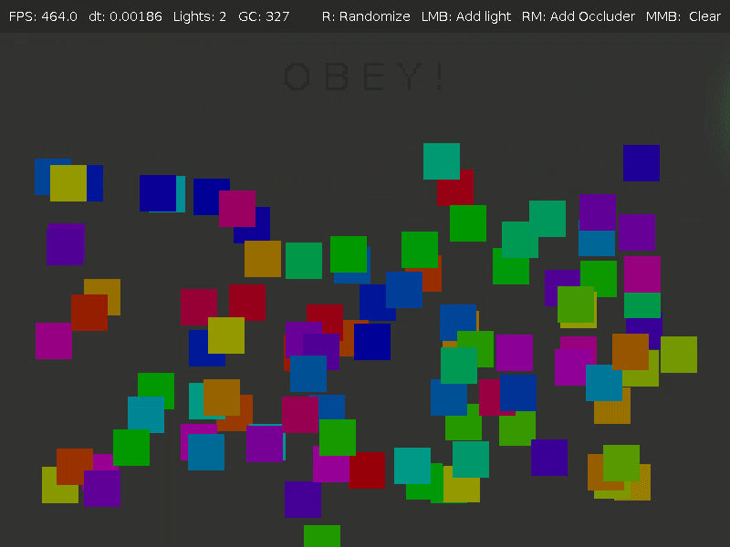

# SIMPLE LOVE LIGHTS

This library is a slight modification to a trivial implementation of raycasting point lights for love2d/LÖVE, in module form.


It is basically just packaging dylhunn's simple-love-lights in a module: https://github.com/dylhunn/simple-love-lights


Which is heavily based on mattdesl's libGDX implementation, described here: https://github.com/mattdesl/lwjgl-basics/wiki/2D-Pixel-Perfect-Shadows


You should realy read the source code, as there is not much documentation,
and the source code is *realy* small.


# LÖVE Version

This library is tested in LÖVE version `0.11.1`.
This should work in LÖVE versions `>= 0.10`.


# Performance considerations

This library creates shadows by creating a shadow map for each light, then
blending them together in a very clever way. But this has some disadvantages. There is a huge cost per-light:
 * You need a new shadow map(seperate canvas), plus alpha-blending for each light.
 * The performance cost is also related to the (screen) size of the light, since the shadow maps dimensions are dependent on it.

But the cost per occluder is basically just drawing it's shape in the light world per light(Which is low compared to other Löve2d light systems).
This makes this library ideal for if you don't want to manually keep track of the occluders.


# API

You must first create a light world, which holds all the needed functions for operation: `world = Lights.newLightWorld()`

In `love.draw()`, you must call the function `world:drawLights(drawOccludersFn, coordTransX, coordTransY)`.

`drawOccludersFn` is a callback that draws all shadow-casting objects in the scene. The Objects are only drawn to the shadow map.


## API functions

```
world = Lights.newLightWorld() --> world
world:addLight(x,y,size,r,g,b) --> light
world:removeLight(light)
world:clearLights()
world:updateLights(drawOccludersFn, coordTransX, coordTransY)
world:drawLights(coordTransX, coordTransY)
```

## Internal Functions
```
world:drawLight(lightInfo, coordTransX, coordTransY)
world:updateLight(drawOccludersFn, lightInfo, coordTransX, coordTransY)
world.LightInfos --> list of light
world.shadowMapShader --> shader
world.lightRenderShade --> shader
```


# TODO

 * one occluderCanvas for the screen rect, modify offset in love.graphics.draw(lightInfo.occludersCanvas, 0, 0)
 * join all lightInfo.lightRenderCanvas in world:updateLights(drawOccludersFn, lightInfo, coordTransX, coordTransY)
 * Global scale
 * Combine multiple lights into 1 canvas
 * Seperate light map update/draw
 * Add screenshot of new example
 * Fix inaccurate borders


# Examples

Run `love .` in this directory.





You can place a square with right-click, and place a light with left-click.
Reset the scene with middle-click. (See `main.lua`)
